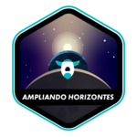

	
	<h1> 42Cursus </h1>

	
	
    

---

## What is 42

42 is a Software Engeneering French school and the top one in Innovation and Ethics. With no professors and courseware, the learning is based on projects and avaliations peer-to-peer, developing both hard skills and soft skills to be a "Human Coder".

The 42 cursus is free for whoever is approved in the [basecamp](https://github.com/LucasDatilioCarderelli/42Basecamp), becoming "cadets" (42's students).

## Projects Done:

			Phase One
	

		
	

	
	
	
	 
	
	
	

---

	Phase Two
	

		
	

	
	
	
	
	

---

## Hard Skills

* ``C``
* ``Shell``
* ``Git``
* ``Makefile``
* ``Unix logic``
* ``Algorithms & AI``
* ``Imperative programming``
* ``Graphics``
* ``Aplicative``
* ``Network & system administration``

## Soft Skills

* ``Human Coder``
* ``Peer-to-Peer Learning``
* ``Self Learning``
* ``Team Working``
* ``Resilience``
* ``Empathy``
* ``Communication``

## Other Projects

* ## [Basecamp](https://github.com/LucasDatilioCarderelli/42Basecamp)

* ## [42Labs](https://github.com/LucasDatilioCarderelli/42labs)

---

