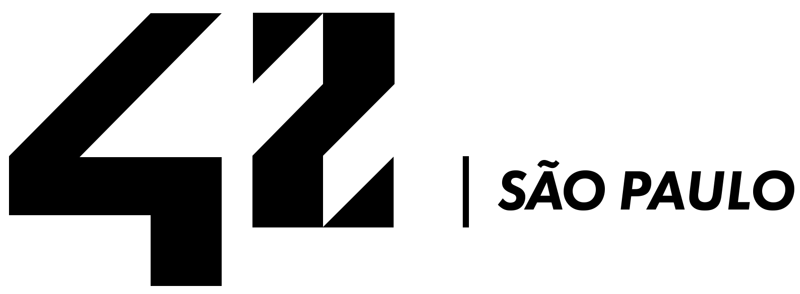

	

<h1 align="center"> 42Cursus </h1>

	
	
    

---

## What is 42

42 is a Software Engeneering French school and the top one in Innovation and Ethics. With no professors and courseware, the learning is based on projects and avaliations peer-to-peer, developing both hard skills and soft skills to be a "Human Coder".

The 42 cursus is free for whoever is approved in the [basecamp](https://github.com/LucasDatilioCarderelli/42Basecamp), becoming "cadets" (42's students).

## Projects Done:

	
	
	
	
	

## Hard Skills

* C
* SHELL
* GIT
* Makefile

## Soft Skills

* Self Learning
* Team Working
* Resilience
* Empathy
